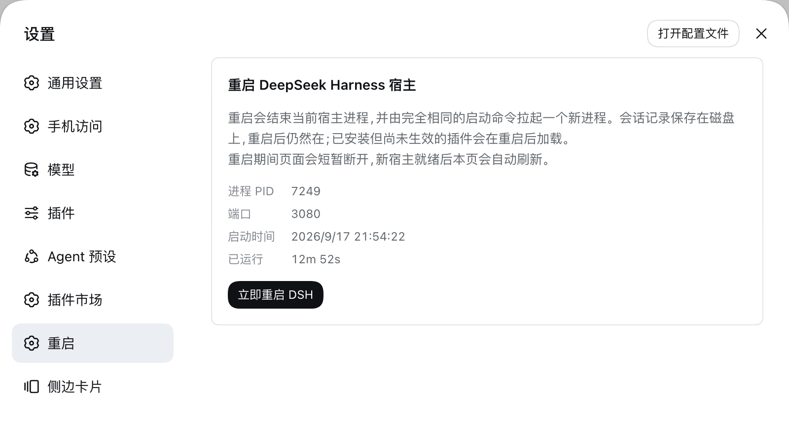

# dsh-restart

[English](README.md) | 中文

在 DeepSeek Harness(dsh)Web 设置面板里多出一个「重启」页:点一下就把正在运行的宿主进程换成新的。



## 它做什么

- **宿主半**在 Web 服务器上注册两个路由,都只接受本机同源的直接请求:
  - `GET /dsh-restart/status` — 当前进程的 boot id、PID、启动时间、端口
  - `POST /dsh-restart/restart` — 替换当前进程(应答 `202` 后宿主退出)
- **浏览器半**注册一个 `settings.section` 页面:显示上述信息并提供重启按钮;点击后轮询 `/dsh-restart/status`,一旦应答的 boot id 变了就刷新页面。

重启由 detached helper 完成:宿主在 400ms 后退出,helper 等到端口不再接受连接,才用**完全相同的启动命令**拉起替代进程(Node 可执行文件、`execArgv`、入口绝对路径、其余 argv、工作目录)。这个顺序保证了替代进程不会在旧 socket 还占着端口时死于 `EADDRINUSE`。日志写在系统临时目录的 `dsh-restart-<时间戳>.out.log` / `.err.log`。

会话记录保存在磁盘上,重启后仍然在;已安装但尚未生效的插件会在下次启动时加载。

## 安装

```sh
# GitHub 源
dsh plugin --profile web add github:DWJZ/dsh-restart

# 本地开发(profile 直接软链检出目录,改完即生效)
dsh plugin --profile web add link:/path/to/dsh-restart
```

首次安装后需要重启一次(在终端重启宿主,或临时用一次 dshmarket 的重启按钮),这个页面才会出现;之后就都用它来重启。

## 端点约定

`POST /dsh-restart/restart` 只接受对端为回环地址、且 `Origin` 与 `Host` 一致的请求;任何转发头(`Forwarded`、`X-Forwarded-For`、`X-Real-IP`)或非回环对端都会以 `403` 拒绝。应答 `202` 后宿主退出,由 helper 拉起替代进程。

## 测试

```sh
node test/smoke.mjs
```

覆盖:detached helper 真的能拉起替代进程、同源校验的四种拒绝路径、客户端 bundle 的注册与渲染。设置 `DSH_CHECKOUT=<dsh 检出目录>` 时额外用该检出里的 React 做一次 SSR 渲染断言;不设置则跳过该条。

## 许可证

[MIT](LICENSE)
